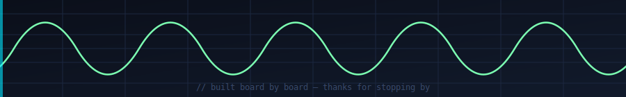

 

  

## ⚡ About Me

I'm **Muhammad Tashfeen**, an electronics engineering student building a **visible, hands-on PCB design portfolio** — not just coursework, real boards, real repos. Every project here is a rung on a circuit ladder I'm climbing on purpose, on the way to freelance PCB work and competitive master's applications.

- 🎓 Electronics Engineering student — heading into a new semester, ~2 years to graduation
- 🛠️ Designing in **KiCad**, simulating in **Wokwi**
- 📡 Currently working through: `ATtiny85 → ESP32 → TP4056 → USB PSU → RS485`
- 🧭 Long game: fundamentals → KiCad mastery → design rules → portfolio ladder → niche specialization → freelancing
- 📚 Learning from **Phil's Lab** and **Robert Feranec** on YouTube
- 💬 Ask me about: schematic capture, PCB layout, power circuits, DFM

## 🪜 The Circuit Ladder

My portfolio isn't a list of tutorials — it's a sequenced progression. Each board unlocks the next.

| # | Board | Focus | Status |
|---|-------|-------|--------|
| 1 | `ATtiny85 LED Blink` | KiCad onboarding, schematic → PCB basics | ✅ |
| 2 | `TP4056 Li-ion Charger` | Power management, protection circuits | 🔧 In progress |
| 3 | `USB Power Supply` | Regulation, USB-C basics | ⏳ Queued |
| 4 | `ESP32 Dev Board` | Wireless MCU, antenna keep-out, decoupling | ⏳ Queued |
| 5 | `RS485 Transceiver` | Differential signaling, industrial comms | ⏳ Queued |

Each repo includes schematic, layout, BOM, and a write-up — built to double as freelance samples and scholarship evidence.

## 🧰 Tools & Stack

  

## 📊 GitHub Stats

## 🐍 Contribution Snake

This animated snake eats your contribution graph — it needs a one-time setup (5 min), see the note at the bottom of this file.

## 📡 Let's Connect

Open to PCB design freelance work — schematics, layout, BOM, DFM review.

<!--
  SETUP NOTES (delete this comment block once done, it won't render on the profile anyway):

  1. Replace the (#) after LinkedIn/Email/Hackster with your real links,
     e.g. (https://linkedin.com/in/your-handle) and (mailto:you@example.com)

  2. The Contribution Snake needs a GitHub Action to generate the SVG:
     - In this repo, go to Actions tab -> "set up a workflow yourself"
     - Name the file: .github/workflows/snake.yml
     - Paste the workflow from: https://github.com/Platane/snk#-usage
     - Commit -> it runs automatically and creates an "output" branch
     - The snake image above will then load correctly
     - This step is optional — everything else in this README works without it
-->

- 💬 Ask me about , 
- 📫 How to reach me: mtashfeen761@gmail.com or 03258460189
- 😄 Pronouns: He/him
- ⚡ Fun fact: Swimmer who enjoys solving engineering problems.
-->
